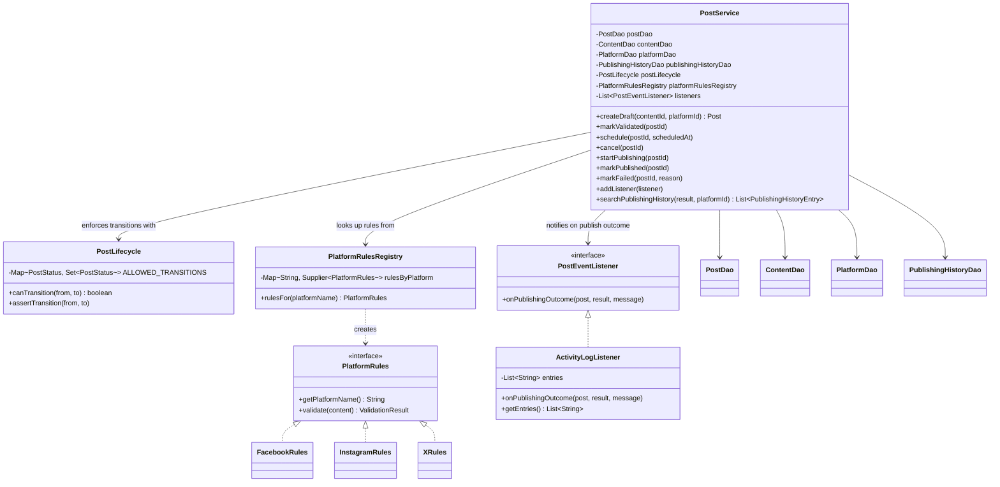

# UML Class Diagram

Shows the service layer, the three pattern implementations it uses, and how they connect to the
DAO/persistence layer. UI controllers (`ContentController`, `PostController`, etc.) call the
services shown here and are omitted for clarity — each simply calls `ContentService` or
`PostService`.

## Where each pattern lives

| Pattern | Classes | Role |
|---|---|---|
| State | `PostLifecycle` | Owns the table of valid `PostStatus` transitions; `PostService` asks it before changing a post's status instead of hard-coding `if` chains per screen. |
| Strategy | `PlatformRules` (interface), `FacebookRules`, `InstagramRules`, `XRules`, `PlatformRulesRegistry` | Each platform's validation logic is its own class behind a common interface; `PostService` picks the right one by platform name at runtime. |
| Observer | `PostEventListener` (interface), `ActivityLogListener` | `PostService` doesn't know who's listening — it just notifies registered listeners when a post finishes publishing. The persisted `publishing_history` row is written the same way, independent of any UI listener. |
