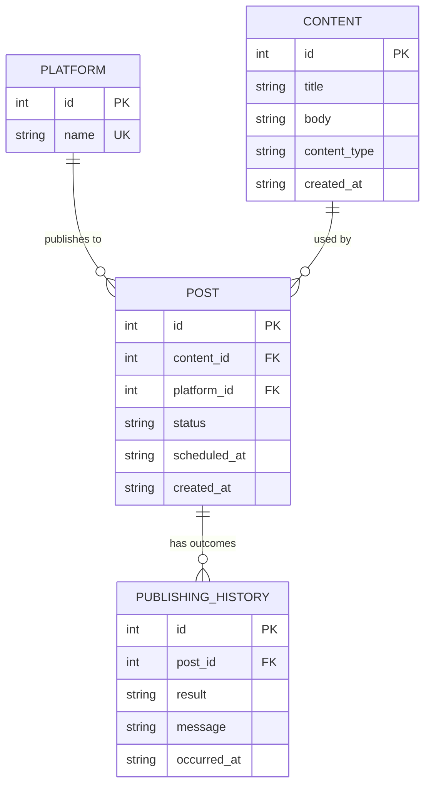

# Database ER Diagram

## Notes

- `content.content_type` is one of `TEXT`, `IMAGE`, `VIDEO`, `PROMOTIONAL`.
- `post.status` moves through the lifecycle: `DRAFT -> VALIDATED -> SCHEDULED -> PUBLISHING ->
  PUBLISHED`, with side branches `DRAFT -> DRAFT` (failed validation), `SCHEDULED -> CANCELLED`,
  and `PUBLISHING -> FAILED -> DRAFT` (retry).
- `publishing_history.result` is `SUCCESS` or `FAILURE`, recorded once per publish attempt.
- `post.platform_id` has `ON DELETE RESTRICT` — a platform in use by a post cannot be deleted,
  since that would leave the post's validation/publishing rules undefined.
- `post.content_id` has `ON DELETE CASCADE` — deleting content removes any posts built from it,
  since a post has no meaning without its content.
- Analytics (likes/views/shares) is intentionally **not** a separate table. The Dashboard and
  Publishing History screens compute their reporting numbers directly from `post` and
  `publishing_history`, which keeps the schema at the required minimum of four meaningful
  entities without a table that exists only to satisfy a count.
